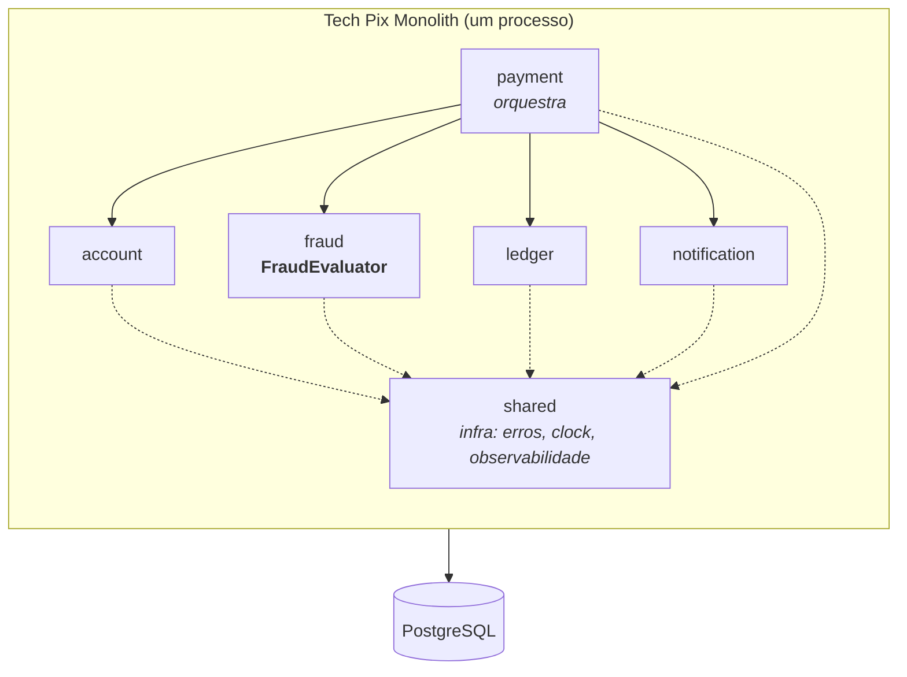

# Fronteiras dos módulos

A partir da etapa 5, o monólito tem fronteiras explícitas. Este documento é o mapa; `ModuleBoundaryTest` é a lei.



## Convenção

```text
com.techpix.<modulo>/            API publica: o que outros modulos podem usar
com.techpix.<modulo>/internal/   privado: ninguem de fora importa
```

## Regras (verificadas por ArchUnit)

| Regra | Por quê |
|---|---|
| Nenhum módulo acessa `*.internal` de outro | a implementação pode mudar sem quebrar ninguém |
| Só Payment conhece Account, Fraud, Ledger e Notification | Payment é o orquestrador; os outros são capacidades independentes |
| Ninguém conhece Payment | se Fraud dependesse de Payment, extrair Fraud levaria Payment junto |
| Fraud não depende de nenhum outro módulo | é a condição para Fraud virar um processo separado |
| Sem ciclos entre módulos | ciclos são o que impede extração |
| `shared` não depende de nenhum módulo | infraestrutura não conhece domínio |

## A fronteira que ArchUnit não vê

`fraud.internal.FraudHistoryRepository` executa `SELECT ... FROM payments`. No código, Fraud não importa nada de Payment. No banco, Fraud lê a tabela de Payment.

A fronteira de código existe. A fronteira de dados não.

Isso é aceitável dentro de um monólito com um único schema. Deixa de ser aceitável quando Fraud virar outro processo e outra equipe: uma migration em `payments` passa a quebrar um serviço que ninguém lembrou de avisar. Esse problema tem nome (Shared Database) e é o assunto do lab 18.

## Fraud como Business Capability

Fraud responde a uma pergunta de negócio: "este pagamento é suspeito?". A API é uma interface, `FraudEvaluator`, com um método.

O que **não** fizemos:

```text
FraudControllerService      -> fronteira por camada tecnica
FraudRepositoryService      -> fronteira por camada tecnica
FraudRulesService           -> fronteira por detalhe de implementacao
```

Fronteiras por camada técnica produzem serviços que precisam conversar entre si a cada requisição. Fronteiras por capacidade produzem serviços que respondem uma pergunta e pronto.
