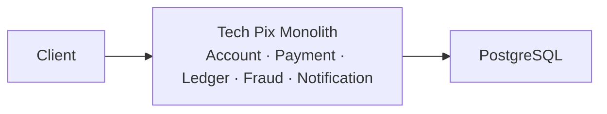
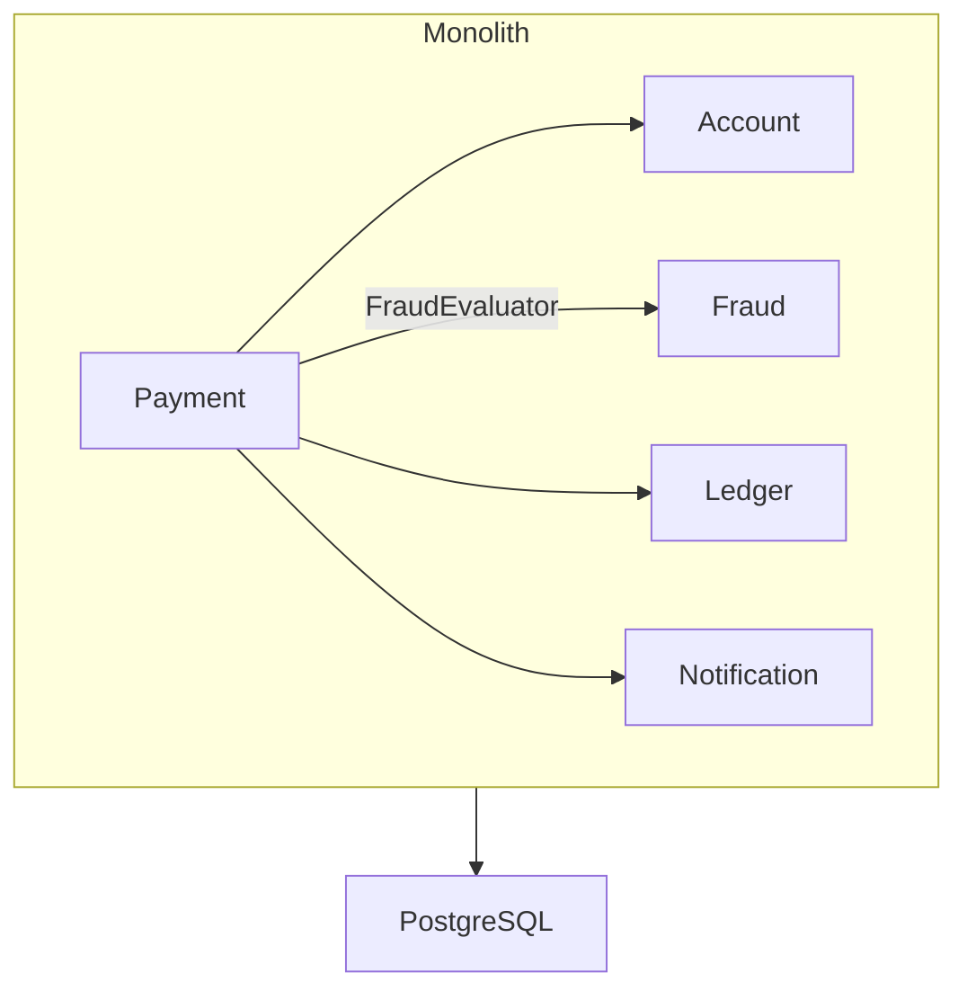
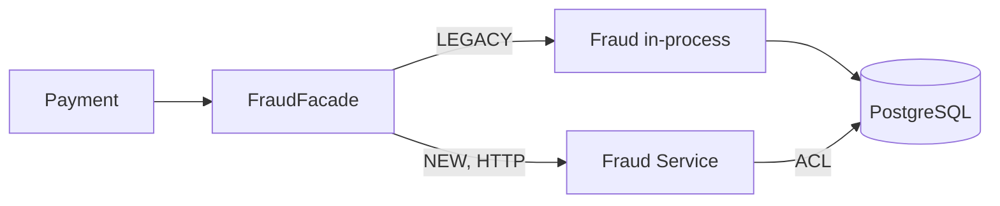
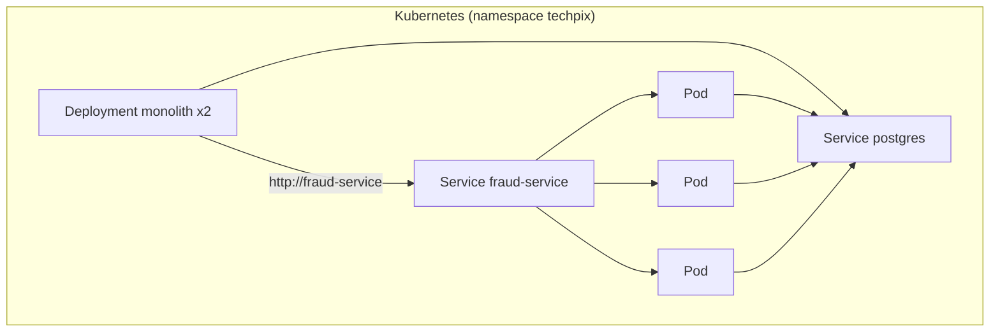
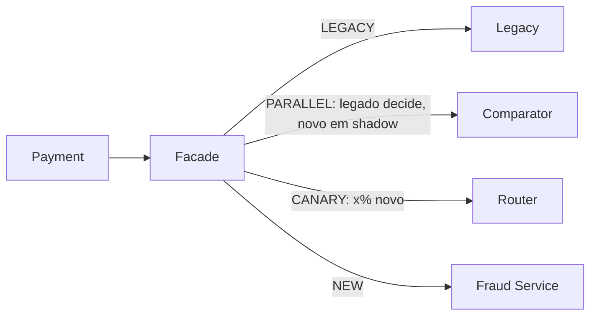
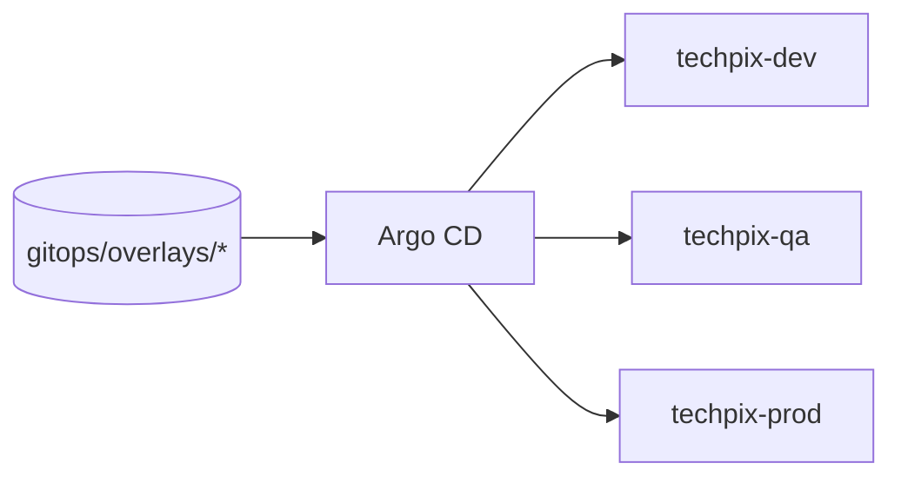
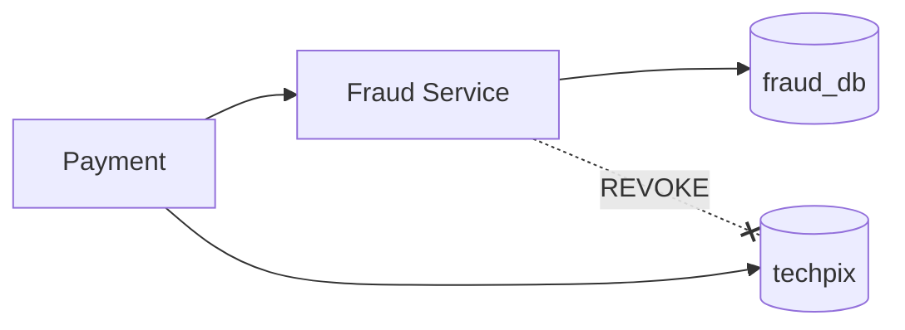
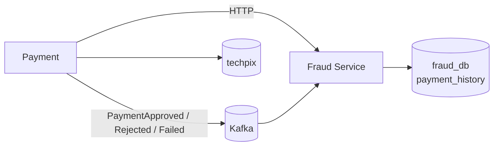
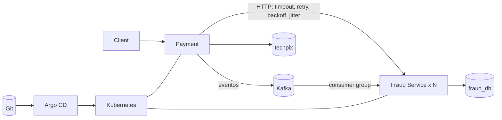

# A evolução da arquitetura, diagrama a diagrama

Nunca mostre o último diagrama no início. Cada um existe por causa de um problema medido no anterior.

## Lab 01 — O monólito que funciona

Nenhum problema. 10 TPS, p95 180 ms.

## Labs 02 a 04 — Cresceu, mediu, otimizou

Mesmo diagrama. O que mudou foi o custo de Fraud (17 regras, 32 consultas por pagamento) e depois a solução dentro do monólito (índices, consultas agregadas, cache, fraude fora da transação). 9 TPS para 193 TPS sem mudar a arquitetura.

## Lab 05 — Modular Monolith

Fronteiras verificadas por ArchUnit. Fraud não depende de ninguém. Nenhuma métrica mudou.

## Labs 07 e 08 — Strangler Fig e Fraud Service

Dois processos, um banco. A rede apareceu: `FraudUnavailableException`.

## Labs 09 a 12 — Kubernetes

Descoberta pelo nome, escala independente, readiness durante o warm-up, HPA por CPU.

## Labs 13 a 15 — Feature Flag, Parallel Run, Canary

Migração reversível, medida em cada degrau.

## Labs 16 e 17 — GitOps e Argo CD

Git é o desired state. Drift é detectado e (onde escolhemos) desfeito.

## Lab 18 — Database per Service

O JOIN desapareceu. A visão local nasce vazia.

## Lab 19 — Kafka

Payment conta; Fraud escuta; consistência eventual; idempotência obrigatória.

## Lab 20 — O sistema distribuído

Cada seta é um lugar onde algo pode falhar de um jeito novo. Cada uma existe por causa de um problema medido.

> Distribuir é consequência, não objetivo.
