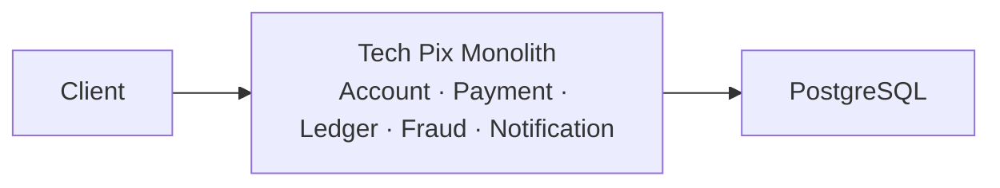

# Lab 01 — O monólito que funciona

**Slide suportado:** 1 — O monólito que funciona
**Tag:** `aula07-step-01-monolith`

## Problema

Nenhum.

Isso precisa ficar claro logo no início. A Tech Pix é um único processo Spring Boot com cinco capacidades de negócio e um PostgreSQL. Atende 10 TPS com p95 de 180 ms e o banco em 20% de CPU. Ninguém reclama.



## O que observar

Um pagamento passa por cinco módulos dentro de **uma única transação de banco**:

```text
POST /payments
   |
   v
PaymentService.create            (@Transactional)
   |-- AccountService.requireActive (payer, payee)
   |-- PaymentRepository.insert (PENDING)
   |-- FraudService.evaluate            <- 5 regras, 2 consultas ao banco
   |-- AccountService.transfer
   |-- LedgerService.record             <- DEBIT + CREDIT
   |-- PaymentRepository.updateStatus (APPROVED)
   '-- NotificationService.notify
```

Se qualquer passo falhar, tudo é desfeito. Não há rede entre os módulos. Não há timeout. Não há retry. Não há consistência eventual. Isso é uma virtude.

Repare em [FraudHistoryRepository.java](../../monolith/src/main/java/com/techpix/fraud/FraudHistoryRepository.java): Fraud lê a tabela `payments` diretamente. É natural. É o mesmo banco. Guarde essa frase.

Repare também em [V1__initial_schema.sql](../../monolith/src/main/resources/db/migration/V1__initial_schema.sql): nenhum índice além das chaves primárias. Com poucas linhas, ninguém sente falta.

## Hipóteses

Não há hipótese a testar. Há uma pergunta: **existe algum problema arquitetural aqui?**

## Mudança

Nenhuma. Esta é a baseline.

## Como executar

```bash
docker compose up -d postgres
./mvnw -pl monolith spring-boot:run
```

Em outro terminal:

```bash
scripts/demo-payment.sh
```

Ou manualmente:

```bash
curl -s -X POST localhost:8080/accounts -H 'Content-Type: application/json' \
  -d '{"ownerName":"Alice","initialBalance":1000}'
# copie o id -> ALICE
curl -s -X POST localhost:8080/accounts -H 'Content-Type: application/json' \
  -d '{"ownerName":"Bob","initialBalance":0}'
# copie o id -> BOB
curl -s -X POST localhost:8080/payments -H 'Content-Type: application/json' \
  -d '{"payerAccountId":"ALICE","payeeAccountId":"BOB","amount":250,"deviceId":"d1"}'
```

## Como testar

```bash
./mvnw test
```

- `FraudRulesTest`: regras puras, sem banco.
- `PaymentFlowIT`: fluxo completo com PostgreSQL real via Testcontainers. Pagamento aprovado move dinheiro, grava duas partidas no ledger e notifica. Pagar para si mesmo é rejeitado e nada se move.

## Resultado esperado

```text
POST /payments -> 201
{
  "status": "APPROVED",
  "fraudScore": 0,
  "fraudRules": [],
  "fraudDurationMs": 3
}
```

## Trade-offs

| Monólito | |
|---|---|
| + | uma transação, consistência forte, deploy único, debug local, zero rede interna |
| + | qualquer pessoa entende o fluxo lendo um arquivo |
| - | todos os módulos escalam juntos |
| - | todos os módulos fazem deploy juntos |
| - | um módulo lento afeta todos |

Hoje nenhum dos pontos negativos dói. Um trade-off só vira problema quando alguém sente.

## Pergunta para discussão

> Se o time dobrar de tamanho e o tráfego triplicar, o que quebra primeiro: o código, o banco ou o processo de deploy?

## Professor Notes

```text
Pergunta:
Este sistema tem um problema arquitetural?

Resposta:
Não. Atende os requisitos com a solução mais simples possível.

Erro comum:
Achar que monólito é sinônimo de legado ou de dívida técnica.

Conceito:
Simplicidade é uma decisão arquitetural válida.

Transição:
A empresa cresceu. O que muda quando o tráfego passa de 10 para 1.000 TPS?
```

## Próximo problema

A Tech Pix cresceu. Fraud ganhou dezenas de regras. O banco começou a saturar. [Lab 02](02-growing-load.md).
