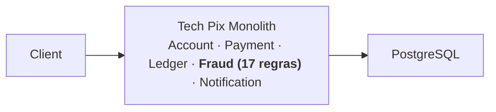

# Lab 02 — O crescimento muda o problema

**Slides suportados:** 2 — O crescimento muda o problema · 3 — Incidente: banco no limite
**Tag:** `aula07-step-02-growth`

## Problema

A Tech Pix cresceu. O tráfego subiu de 10 para ~1.000 TPS no cenário de negócio. Fraud, que tinha 5 regras, agora tem 17:

| Regra | Motivo de negócio | Custo escondido |
|---|---|---|
| velocity | limites por hora, dia e semana | 3 consultas carregando todas as linhas da janela para somar em Java |
| device-fingerprint | um dispositivo em muitas contas | seq scan em `device_id`, sem índice |
| blacklist | contas e dispositivos banidos | 3 consultas por pagamento em tabela sem índice |
| payee-reputation | destinatário com muitas rejeições | seq scan em `payee_account_id` |
| average-ticket | valor fora do padrão do pagador | carrega **todo** o histórico do pagador |
| behavioral-hour | pagador nunca paga nesse horário | carrega **o mesmo** histórico de novo |
| payee-velocity | mula financeira | seq scan |
| recent-rejections | rejeições nas últimas 24h | N+1: uma consulta por pagamento recente |
| new-account | conta criada há < 24h | 1 consulta barata |
| round-amount | valores redondos | nenhuma |
| external-provider | bureau externo | 30 ms de espera **dentro da transação** |
| ml-scoring | modelo de risco | CPU pura, no mesmo processo que atende Payment |

Cada regra foi adicionada por um motivo legítimo. Ninguém somou o custo.

A arquitetura não mudou:



## Evidência

Medido nesta máquina (4 cores para o container do PostgreSQL, 200 mil pagamentos históricos, 40 usuários virtuais). O que importa é a proporção, não o valor absoluto.

| | SIMPLE (5 regras) | HEAVY (17 regras) |
|---|---|---|
| Throughput | 82 TPS | 12 TPS |
| p95 HTTP | 666 ms | 4,25 s |
| p95 Fraud | 111 ms | 1,09 s |
| PostgreSQL CPU | baixo | ~400% (todos os cores) |
| Conexões esperando no pool | 0 | dezenas |

Mesma carga. Mesmas contas. Mesmo banco. **Só o perfil de Fraud mudou.**

Repare em um detalhe: com `HEAVY`, Fraud leva 713 ms (p50) mas a requisição leva 3,07 s (p50). Onde estão os outros 2,3 s? Na fila do pool de conexões. São 40 usuários disputando 10 conexões, e cada uma fica presa durante toda a avaliação de Fraud, inclusive durante os 30 ms em que a thread dorme esperando o provider externo.

## O que observar

```text
http_req_duration p95      latência que o cliente sente
fraud_duration_ms p95      quanto disso é Fraud
fraud_rules_evaluated      5 vs 17
docker stats postgres      CPU do banco
hikaricp.connections.pending   threads esperando conexão
```

## Hipóteses

Neste momento, a equipe da Tech Pix costuma ouvir:

1. "O banco está no limite. Precisamos de um banco maior."
2. "O monólito não escala. Precisamos de microserviços."
3. "Fraud está lento. Precisamos de cache."

Todas são hipóteses. Nenhuma é conclusão. Ainda não medimos **quem** consome o banco.

## Mudança

- 12 regras novas em [fraud/rules/heavy/](../../monolith/src/main/java/com/techpix/fraud/rules/heavy/), ativadas pelo perfil `HEAVY`.
- Tabela `fraud_blacklist` sem índice, em [V2__fraud_blacklist.sql](../../monolith/src/main/resources/db/migration/V2__fraud_blacklist.sql).
- Endpoint administrativo para trocar o perfil ao vivo: `PUT /admin/fraud/profile`.
- Seed de histórico: `POST /admin/seed`.
- Gerador de carga com k6: [payment-load.js](../../load-tests/payment-load.js).

## Como executar

```bash
scripts/start.sh                     # postgres + monolito
scripts/seed.sh                      # 2.000 contas, 200.000 pagamentos, 2.000 blacklist
scripts/fraud-profile.sh SIMPLE
scripts/load-test.sh growth          # 40 VUs por 60s
scripts/fraud-profile.sh HEAVY
scripts/load-test.sh growth          # mesma carga
docker stats techpix-postgres        # em outro terminal, durante a carga
```

Ajuste `TECHPIX_FRAUD_ML_ITERATIONS` e `TECHPIX_FRAUD_PROVIDER_LATENCY_MS` se a máquina for muito mais lenta ou mais rápida que a de referência.

## Como testar

```bash
./mvnw test
```

- `FraudProfileIT`: o mesmo pagamento avaliado por 5 e por 17 regras; o perfil pode ser trocado em runtime.
- `HeavyRulesTest`: o modelo de ML simulado é determinístico e seu custo cresce com as iterações.

## Resultado esperado

Latência sobe uma ordem de grandeza. Throughput cai. O banco satura. O pool enfileira.

Nenhum erro. Nenhuma exceção. Nenhum log de alerta. O sistema "funciona". Só que lento.

## Trade-offs

Ainda nenhum trade-off arquitetural foi feito. O que existe é uma dívida que cresceu regra a regra, cada uma justificada isoladamente.

## Pergunta para discussão

> O banco a 85% de CPU prova que precisamos de microserviços?

## Professor Notes

```text
Pergunta:
O banco em 85% prova que precisamos de microserviços?

Resposta:
Não. Prova que alguém está consumindo o banco. Ainda não sabemos quem.

Erro comum:
Confundir sintoma de infraestrutura com necessidade de distribuição.
Outro erro comum: "vamos aumentar o pool de conexões" (mais conexões disputando o mesmo banco saturado).

Conceito:
Measure before redesign.

Transição:
Vamos descobrir quem está consumindo o banco. Precisamos de instrumentos.
```

## Próximo problema

Sabemos que está lento. Não sabemos por quê. [Lab 03](03-investigating-performance.md) instrumenta o sistema antes de qualquer mudança.
