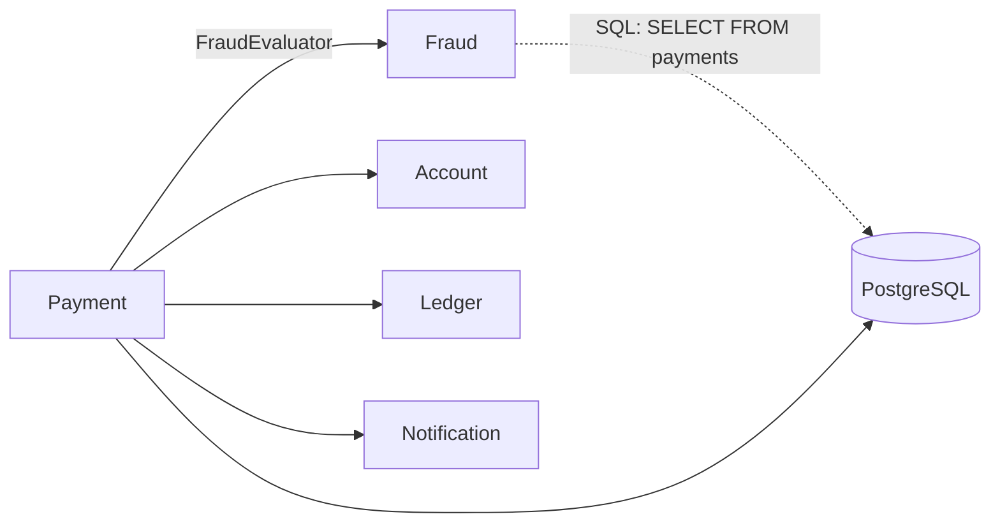

# Lab 05 — Modular Monolith

**Slide suportado:** 7 — Modular Monolith
**Tag:** `aula07-step-05-modular`

## Problema

Fraud está rápido. Mas onde Fraud começa e termina?

Até a etapa 4, `PaymentService` dependia de `FraudService` (a implementação). Qualquer regra de fraude podia importar `PaymentRepository`. Qualquer módulo podia chamar qualquer repositório. Não havia nada errado em execução; havia algo errado em **estrutura**: as fronteiras existiam só na cabeça de quem escreveu o código.

Se um dia precisarmos tirar Fraud daqui, precisamos saber exatamente o que sai.

## O que observar

Nenhuma métrica de performance muda nesta etapa. O que muda é o que o compilador e os testes deixam ou não deixam fazer.

```text
git diff aula07-step-04-optimized aula07-step-05-modular --stat
```

Repare: quase tudo é movimentação de arquivos e imports. A lógica não mudou.

## Hipóteses

> Se as fronteiras forem explícitas, extrair Fraud vira uma decisão que pode ser tomada com segurança. Se não forem, extrair vira arqueologia.

## Mudança

Ver [boundaries.md](../architecture/boundaries.md) para o mapa completo. Em resumo:

1. Cada módulo ganhou um pacote `internal`. Repositórios, regras e configuração vivem lá.
2. Fraud expõe uma interface, [FraudEvaluator.java](../../monolith/src/main/java/com/techpix/fraud/FraudEvaluator.java). `PaymentService` depende dela, não de `FraudService`.
3. [ModuleBoundaryTest.java](../../monolith/src/test/java/com/techpix/architecture/ModuleBoundaryTest.java) (ArchUnit) verifica cinco regras. A mais importante: **Fraud não depende de nenhum outro módulo**.
4. Cada módulo tem um `package-info.java` explicando sua API.



A seta pontilhada é a fronteira que ArchUnit não vê: Fraud lê a tabela de Payment. Fronteira de código, sim. Fronteira de dados, não.

## Como executar

```bash
./mvnw test -pl monolith -Dtest=ModuleBoundaryTest
```

Para ver o teste falhar, adicione em qualquer regra de fraude:

```java
import com.techpix.payment.internal.PaymentRepository;
```

e rode de novo. A mensagem diz exatamente qual classe violou qual regra.

## Como testar

- `ModuleBoundaryTest`: cinco regras de fronteira.
- Todos os testes anteriores continuam verdes: a lógica não mudou.

## Resultado esperado

```text
Tests run: 5, Failures: 0 -- in com.techpix.architecture.ModuleBoundaryTest
```

E um `git diff` que é 90% `import` e `package`.

## Trade-offs

| Modular Monolith | |
|---|---|
| + | fronteiras verificáveis, sem rede, sem deploy separado |
| + | `FraudEvaluator` permite trocar a implementação (é o que o Strangler Fig vai usar) |
| + | mesmo processo, mesma transação, mesmo debug |
| - | a fronteira de dados continua inexistente: Fraud faz `SELECT FROM payments` |
| - | disciplina: um `import` errado passa em code review se ninguém rodar o teste (por isso ele está no `mvn test`) |
| - | nenhum ganho de escala: Fraud e Payment continuam escalando juntos |

## Pergunta para discussão

> Modularidade é uma decisão de design. Distribuição é uma decisão operacional. O que muda quando confundimos as duas?

## Professor Notes

```text
Pergunta:
O que este passo melhorou em performance?

Resposta:
Nada. E isso e o ponto. Modularizar nao e otimizar nem distribuir.

Erro comum:
Achar que "microservicos" e a unica forma de ter fronteiras. Um teste ArchUnit
da fronteiras com zero custo operacional.

Conceito:
Boundary antes do servico. Fraud e uma Business Capability, nao uma camada.

Transicao:
Fraud esta rapido e tem fronteira clara. Ainda assim, Fraud e Payment escalam juntos.
Isso importa? Vamos olhar o perfil operacional de cada um.
```

## Próximo problema

Fraud está otimizado e isolado no código. Mas seu custo dominante agora é rede e CPU, e ele continua no mesmo processo que Payment. Para escalar Fraud, escalamos Payment junto. [Lab 06](06-extraction-decision.md).
