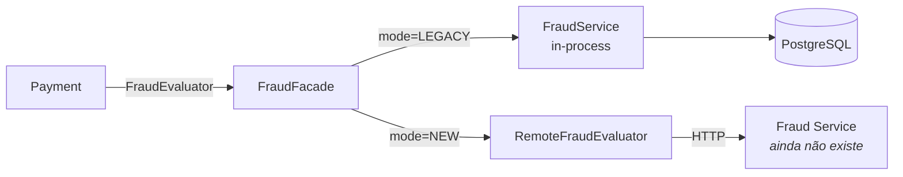

# Lab 07 — Strangler Fig

**Slide suportado:** 11 — Strangler Fig
**Tag:** `aula07-step-06-strangler`

## Problema

Decidimos extrair Fraud. Se fizermos isso de uma vez (apagar o módulo, subir um serviço, apontar Payment para ele), qualquer diferença de comportamento vira incidente em produção, e voltar atrás significa outro deploy.

Precisamos de uma extração **reversível**, em que legado e novo convivam.

## O que observar

```text
scripts/fraud-mode.sh            modo atual
fraud.remote.roundtrip           timer: tempo de ida e volta ao Fraud Service
FRAUD_SERVICE.calls()            nos testes: quantas vezes o remoto foi chamado
```

## Hipóteses

> Se Payment depender só de `FraudEvaluator` (lab 05), podemos colocar uma fachada atrás dessa interface que escolhe a implementação por configuração. Trocar e voltar vira uma chamada HTTP.

## Mudança

```text
Payment
   |
   v
FraudFacade  (implementa FraudEvaluator, @Primary)
   |
   +------> FraudService          legado, in-process
   |
   +------> RemoteFraudEvaluator  novo, HTTP -> Fraud Service
```



- [FraudFacade.java](../../monolith/src/main/java/com/techpix/fraud/internal/strangler/FraudFacade.java): o `switch` que escolhe.
- [RemoteFraudClient.java](../../monolith/src/main/java/com/techpix/fraud/internal/strangler/RemoteFraudClient.java): o contrato HTTP. Repare no que apareceu e não existia numa chamada de método: URL, timeout de conexão, timeout de leitura, serialização.
- [RemoteFraudEvaluator.java](../../monolith/src/main/java/com/techpix/fraud/internal/strangler/RemoteFraudEvaluator.java): traduz falhas de rede em `FraudUnavailableException`.
- [PaymentService.java](../../monolith/src/main/java/com/techpix/payment/PaymentService.java): quando Fraud não responde, o pagamento é rejeitado (fail closed) e o cliente recebe 503. **Este bloco `catch` não existia antes da extração.**
- `PUT /admin/fraud/mode`: troca o modo em runtime.

O Fraud Service ainda não existe. Nesta etapa ele é substituído por um falso nos testes ([FakeFraudService.java](../../monolith/src/test/java/com/techpix/support/FakeFraudService.java), 60 linhas com o `HttpServer` do JDK). Isso é intencional: **o contrato nasce do lado de quem consome**.

## Como executar

```bash
scripts/fraud-mode.sh            # LEGACY
scripts/fraud-mode.sh NEW
scripts/demo-payment.sh          # 503: fraud service unreachable (ainda nao existe)
scripts/rollback.sh              # LEGACY de novo
scripts/demo-payment.sh          # 201 APPROVED
```

## Como testar

`StranglerIT`:

| Teste | O que prova |
|---|---|
| `legacyModeNeverCallsTheRemoteService` | em LEGACY, zero chamadas HTTP |
| `newModeUsesTheRemoteDecision` | em NEW, a decisão vem do remoto; o contrato envia só o necessário |
| `rollbackIsAConfigurationChangeNotADeploy` | remoto quebrado, 503; `PUT /admin/fraud/mode` LEGACY; 201 |
| `remoteTimeoutDoesNotHangPayment` | remoto demora 2 s, Payment desiste em 500 ms |

## Resultado esperado

Legado e novo convivem. Trocar é uma chamada HTTP. Voltar é outra.

## Trade-offs

| Strangler Fig | |
|---|---|
| + | migração reversível; rollback sem deploy |
| + | os dois caminhos podem ser comparados (próximos labs) |
| + | o contrato HTTP nasce do consumidor, antes do serviço existir |
| - | duas implementações para manter durante a transição |
| - | uma fachada a mais no caminho crítico |
| - | o modo é estado em memória: cada réplica do monólito tem o seu. Com várias réplicas, alguém precisa sincronizar (lab 16, GitOps) |

## Pergunta para discussão

> O que o `catch (FraudUnavailableException)` diz sobre a diferença entre uma chamada de método e uma chamada de rede?

## Professor Notes

```text
Pergunta:
Por que nao apagar o FraudService legado agora que existe o remoto?

Resposta:
Porque ainda nao sabemos se o remoto decide igual, nem se aguenta a carga.
O legado e o plano de rollback.

Erro comum:
Extrair e apagar no mesmo passo. Quando algo diverge, nao ha para onde voltar.

Conceito:
Strangler Fig: o novo cresce em volta do velho ate poder substitui-lo. Reversibilidade e requisito.

Transicao:
A fachada aponta para http://localhost:8081. Nao tem ninguem la. Vamos construir o Fraud Service.
```

## Próximo problema

O contrato existe. O serviço não. [Lab 08](08-fraud-service.md) constrói o Fraud Service como um processo Spring Boot independente.
