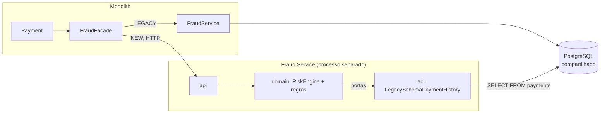

# Lab 08 — Self-contained Fraud Service + Anti-Corruption Layer

**Slide suportado:** 12 — Self-contained Service + ACL
**Tag:** `aula07-step-07-fraud-service`

## Problema

A fachada do lab 07 aponta para `http://localhost:8081`. Não há ninguém lá.

Precisamos de um processo que responda `POST /fraud/evaluations` com o mesmo contrato e a **mesma decisão** que o Fraud legado daria, para que a troca seja invisível para Payment.

## O que observar

```text
fraud-service/                       um projeto Spring Boot proprio
  com.techpix.fraudservice            pacote proprio, nao e com.techpix.fraud
    api/                              o contrato HTTP (definido pelo consumidor no lab 07)
    domain/                           RiskEngine, regras, PORTAS (PaymentHistory, AccountFacts, Blacklist)
    acl/                              Anti-Corruption Layer: le o schema do monolito e traduz
    persistence/                      grava avaliacoes
    health/                           readiness com warm-up
```

E o que ele **não** tem: `Payment`, `Account`, `Ledger`, `Notification`. Nenhuma classe do monólito. Zero dependência de código entre os dois projetos.

## Hipóteses

> Se o domínio de risco depender de portas (interfaces) e não de tabelas, podemos trocar a fonte do histórico sem tocar nas regras. Hoje a fonte é o schema do monólito. Amanhã será outra.

## Mudança



### Onde a ACL existe e por quê

[LegacySchemaPaymentHistory.java](../../fraud-service/src/main/java/com/techpix/fraudservice/acl/LegacySchemaPaymentHistory.java) é a única classe do serviço que conhece as tabelas `payments` e `accounts`. Ela traduz:

| Schema legado (dono: Payment/Account) | Domínio de Fraud |
|---|---|
| `payments.status = 'REJECTED'` (string) | `PayerSnapshot.rejectedLastDay()` (número) |
| `payments.payer_account_id`, `created_at`, `amount` | `PayerSnapshot` com 8 agregados |
| `accounts.created_at` | `AccountFacts.accountOpenedAt()` (`Optional<Instant>`) |

Se Payment renomear uma coluna, quebra **um arquivo**, com "Legacy" no nome. As 13 regras não sabem que a tabela existe. [DomainIsolationTest.java](../../fraud-service/src/test/java/com/techpix/fraudservice/architecture/DomainIsolationTest.java) garante: o domínio não importa JDBC, e só o pacote `acl` toca em classes `Legacy*`.

O que a ACL **não** faz: eliminar o acoplamento. Ela o isola. Uma migration em Payment ainda pode quebrar o Fraud Service. Veja [legacy-schema.sql](../../fraud-service/src/test/resources/legacy-schema.sql): para testar o serviço, tivemos que **copiar o schema do monólito**. Esse arquivo é a prova material do problema que o lab 18 resolve.

### Health checks

[WarmupReadiness.java](../../fraud-service/src/main/java/com/techpix/fraudservice/health/WarmupReadiness.java): liveness UP desde o início; readiness DOWN até a blacklist estar em memória e o warm-up terminar. Volta no lab 12.

### Paridade com o legado

Mesmas 13 regras do perfil `HEAVY_OPTIMIZED`, mesmos limiares, mesmos pesos. Isso é deliberado: o serviço precisa decidir **igual** para poder substituir. Divergências serão medidas no lab 14.

## Como executar

```bash
scripts/start-fraud-service.sh        # terminal 1: Fraud Service em :8081
scripts/start.sh                      # terminal 2: monolito em :8080
scripts/fraud-mode.sh NEW             # terminal 3
scripts/demo-payment.sh
scripts/rollback.sh
```

Nos logs dos dois processos aparece o mesmo `payment=...`: um pagamento agora atravessa dois processos.

## Como testar

```bash
./mvnw test -pl fraud-service
```

| Teste | O que prova |
|---|---|
| `RiskEngineTest` | domínio puro: portas implementadas inline, sem Spring, sem banco |
| `FraudEvaluationIT` | HTTP até PostgreSQL com o schema legado; grava em `fraud_evaluations` |
| `HealthProbesIT` | liveness UP, readiness DOWN durante o warm-up, UP depois |
| `DomainIsolationTest` | domínio não conhece JDBC/HTTP; só a ACL conhece `Legacy*` |

## Resultado (medido)

Monólito em `NEW`, um pagamento:

```text
fraud-service: evaluation payment=4b2e... score=20 decision=APPROVED rules=[new-account] durationMs=83
monolith:      payment=4b2e... status=APPROVED score=20 totalMs=632 fraudMs=431 queries=11 fraudRules=13
```

`queries=11` no monólito: as consultas de Fraud saíram do processo de Payment. `fraudMs=431` contra `durationMs=83` no serviço: a diferença é rede, serialização e a primeira conexão HTTP. Vamos medir isso com carga mais adiante.

## Trade-offs

| Self-contained service | |
|---|---|
| + | projeto próprio, deploy próprio, vocabulário próprio |
| + | domínio testável sem infraestrutura |
| + | ACL concentra o conhecimento sobre o schema legado em um lugar |
| - | 13 regras existem em dois lugares (monólito e serviço) durante a transição |
| - | o serviço depende de um schema que não é dele; testes precisam de uma cópia |
| - | dois processos para subir, dois logs para correlacionar |

## Pergunta para discussão

> A ACL elimina o acoplamento com o schema legado ou apenas o esconde? Qual é a diferença prática?

## Professor Notes

```text
Pergunta:
Por que o pacote e com.techpix.fraudservice e nao com.techpix.fraud?

Resposta:
Porque e outro projeto. Compartilhar pacote convidaria a compartilhar classes,
e ai a "extracao" seria uma biblioteca comum disfarcada de servico.

Erro comum:
Criar um modulo "techpix-common" com os records de Payment e Fraud e usa-lo nos dois lados.
Isso acopla os deploys: mudou o common, redeploy nos dois.

Conceito:
Self-contained: API, dominio, configuracao, health, metricas, Dockerfile. Tudo dentro.
ACL: traduz o mundo de fora para o vocabulario de dentro, em um so lugar.

Transicao:
Fraud Service roda com java -jar. Precisamos empacota-lo para rodar em qualquer lugar.
```

## Próximo problema

O serviço existe e roda com `java -jar`. Para subir os dois processos e o banco de forma reproduzível, precisamos de containers. [Lab 09](09-kubernetes.md) começa por Docker Compose e, a partir de uma pergunta simples, chega a Kubernetes.
