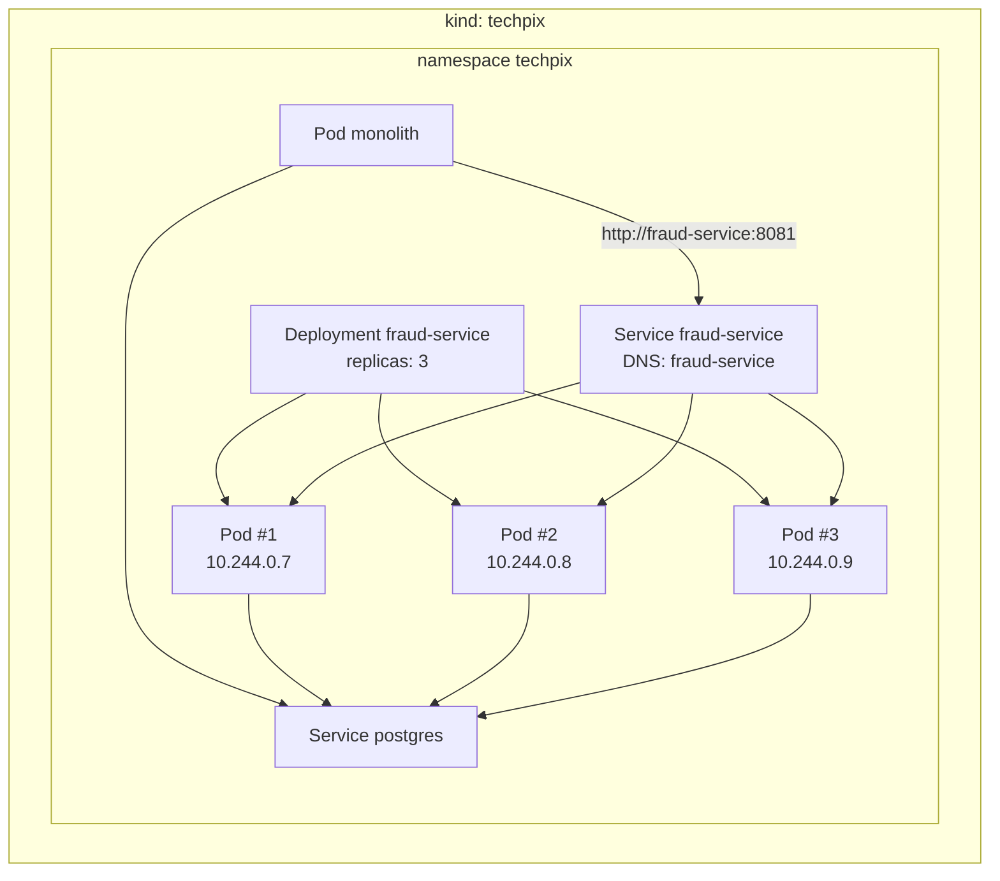

# Lab 09 — Onde Fraud roda? Containers e Kubernetes

**Slides suportados:** 13 — Onde Fraud roda? · 14 — Deployment, Pod e Service
**Tag:** `aula07-step-08-kubernetes`

## Problema

Fraud é um processo. Roda com `java -jar`. E agora?

```text
Em qual maquina?
Quantas copias?
Quem reinicia quando morre?
Como Payment encontra o Fraud, se o IP muda a cada reinicio?
Como saber se uma copia esta pronta?
```

Nenhuma dessas perguntas existia quando Fraud era um pacote.

## Parte 1: containers (Docker Compose)

Primeiro, empacotar. Cada serviço tem um `Dockerfile` em duas etapas (build com Maven, runtime só com o JRE):

- [monolith/Dockerfile](../../monolith/Dockerfile)
- [fraud-service/Dockerfile](../../fraud-service/Dockerfile)

O [docker-compose.yml](../../docker-compose.yml) sobe os três (`postgres`, `monolith`, `fraud-service`) com um comando:

```bash
TECHPIX_FRAUD_MODE=NEW docker compose --profile app up -d
scripts/demo-payment.sh
docker compose logs fraud-service | grep evaluation
```

Repare em `TECHPIX_FRAUD_SERVICE_URL: http://fraud-service:8081`. Dentro da rede do Compose, o nome do serviço é o endereço. Isso já é service discovery, em versão de uma máquina só.

Compose responde "onde roda" para **uma máquina**. Não responde as outras perguntas.

## Parte 2: Kubernetes



| Manifest | Responde |
|---|---|
| [fraud-service/deployment.yaml](../../kubernetes/fraud-service/deployment.yaml) | quantas cópias (3), qual imagem, como atualizar (`maxUnavailable: 0`), quanto reservar, como checar saúde |
| [fraud-service/service.yaml](../../kubernetes/fraud-service/service.yaml) | o nome estável `fraud-service` e a lista de Pods prontos |
| [fraud-service/configmap.yaml](../../kubernetes/fraud-service/configmap.yaml) | configuração fora da imagem |
| [monolith/configmap.yaml](../../kubernetes/monolith/configmap.yaml) | `TECHPIX_FRAUD_SERVICE_URL: http://fraud-service:8081` |
| [monolith/secret.yaml](../../kubernetes/monolith/secret.yaml) | senha do banco (em texto só porque é laboratório) |

## O que observar

```bash
kubectl -n techpix get pods -o wide        # IPs dos Pods: efemeros
kubectl -n techpix get svc                 # o nome estavel
kubectl -n techpix get endpoints fraud-service   # quais IPs o Service conhece AGORA
kubectl -n techpix logs -l app=fraud-service --tail=5
```

## Como executar

Pré-requisitos: Docker, kind, kubectl (todos já verificados no início da aula).

```bash
scripts/k8s-up.sh          # cria o cluster, carrega imagens, aplica manifests, espera rollout
TECHPIX_URL=http://localhost:8090 scripts/fraud-mode.sh NEW
TECHPIX_URL=http://localhost:8090 scripts/demo-payment.sh
scripts/k8s-down.sh        # quando terminar
```

O cluster não usa registry: `kind load docker-image` copia as imagens locais para dentro do node.

## Resultado (medido)

```text
NAME                             READY   STATUS    RESTARTS      AGE   IP
fraud-service-867797b66d-dhgnd   1/1     Running   0             85s   10.244.0.9
fraud-service-867797b66d-jmtdw   1/1     Running   0             85s   10.244.0.8
fraud-service-867797b66d-nttj8   1/1     Running   0             85s   10.244.0.7
monolith-78fd4b95-hxjg6          1/1     Running   2 (53s ago)   85s   10.244.0.10
monolith-78fd4b95-t45rm          1/1     Running   2 (53s ago)   85s   10.244.0.11
postgres-795bf7b4f6-qrn8p        1/1     Running   0             85s   10.244.0.12
```

Repare em `RESTARTS: 2` no monólito: ele subiu antes do PostgreSQL, o Flyway falhou, o processo morreu, o kubelet reiniciou. Duas vezes. Na terceira, o banco estava pronto. Ninguém fez nada. Isso é o Deployment fazendo o trabalho de um operador de plantão. E também é um sinal que, em produção, alguém precisa entender.

## Trade-offs

```text
Kubernetes
+ reinicio, escala e descoberta declarados em YAML
+ Payment chama um nome, nunca um IP
+ readiness impede trafego para quem nao esta pronto

- curva de aprendizado: Pod, Deployment, Service, probe, request, limit
- um cluster para operar (o kind esconde isso; producao nao)
- YAML sem revisao vira drift (lab 16)
- debug mais distante: logs, exec, port-forward
```

## Pergunta para discussão

> O Compose já resolvia "nome em vez de IP". O que exatamente Kubernetes acrescenta que justifica a complexidade?

(Reinício automático, múltiplas cópias com balanceamento, readiness, escala por métrica, e tudo isso em mais de uma máquina.)

## Professor Notes

```text
Pergunta:
Por que Kubernetes so entra agora, e nao no lab 01?

Resposta:
Porque ate o lab 07 nao havia um segundo processo. Kubernetes resolve
problemas de processos independentes. Sem eles, e custo sem contrapartida.

Erro comum:
Comecar o projeto pelo cluster. "Vamos subir o EKS e depois a gente ve o que roda nele."

Conceito:
Deployment = quantas copias e como atualizar. Pod = a copia. Service = o nome estavel.

Transicao:
Payment chama http://fraud-service. Vamos provar que ele nunca precisa saber um IP.
```

## Próximo problema

Os Pods têm IPs. Payment não conhece nenhum deles. Como isso funciona quando um Pod morre? [Lab 10](10-service-discovery.md).
