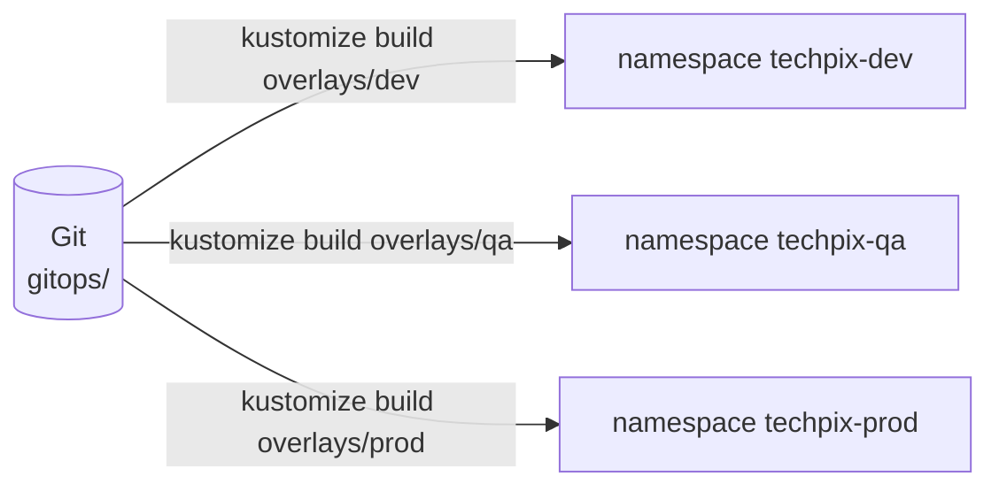

# Lab 16 — Configuração dos ambientes e GitOps

**Slide suportado:** 21 — Configuração dos ambientes
**Tag:** `aula07-step-11-gitops-argocd`

## Problema

Depois dos labs 13 a 15, a Tech Pix tem configuração que muda o sistema sem deploy: modo da flag, percentual do canário, réplicas, warm-up, timeouts. E três ambientes.

```text
DEV   = configuracao A
QA    = configuracao B
PROD  = alguem alterou manualmente
```

Pergunte à turma: qual é o estado **desejado** de PROD agora? A resposta honesta é "vamos olhar o cluster". Isso significa que o cluster virou a fonte de verdade, e o cluster não tem histórico, não tem revisão, não tem `git blame`.

Some a isso o problema do lab 13: a flag vive na memória de cada réplica. `PUT /admin/fraud/mode` em um monólito com 2 réplicas muda uma delas.

## O que observar

```bash
git log --oneline -- gitops/overlays/prod      # quem mudou PROD, quando
kubectl kustomize gitops/overlays/qa           # o desired state de QA, renderizado
diff <(kubectl kustomize gitops/overlays/qa) <(kubectl kustomize gitops/overlays/prod)
```

## Mudança

```text
gitops/
  base/                       o que e igual em todos os ambientes
    postgres/ monolith/ fraud-service/
    kustomization.yaml
  overlays/
    dev/                      1 monolith, 2 fraud, PARALLEL, warm-up 5s
    qa/                       2 monolith, 3 fraud, CANARY 10%, warm-up 20s
    prod/                     2 monolith, 4 fraud + HPA, CANARY 1%, timeout 1s
```

Cada overlay tem três patches: réplicas, ConfigMap, NodePorts. O que não está no patch vem da base. `kubernetes/kustomization.yaml` (labs 09 a 12) agora aponta para `../gitops/base`: não há dois lugares para os manifests.



Regra nova, escrita no [ADR 005](../adr/005-use-gitops.md): **fora de DEV, configuração muda por commit.** Nada de `kubectl scale`, `kubectl edit` ou `PUT /admin/...` em QA e PROD.

## Como executar

```bash
scripts/k8s-up.sh gitops dev            # namespace techpix-dev, portas 8090/8091
kubectl apply -k gitops/overlays/qa      # techpix-qa, portas 8092/8093
kubectl apply -k gitops/overlays/prod    # techpix-prod, portas 8094/8095

curl localhost:8090/admin/fraud/mode     # {"mode":"PARALLEL"}
curl localhost:8092/admin/fraud/canary   # {"percentage":10,"mode":"CANARY"}
curl localhost:8094/admin/fraud/canary   # {"percentage":1,"mode":"CANARY"}
```

Os três ambientes no mesmo cluster, em namespaces diferentes, com configurações diferentes, todas legíveis no Git.

### Simulando o drift

```bash
kubectl -n techpix-prod scale deploy fraud-service --replicas=1     # "alguem" fez isso as 14h
kubectl -n techpix-prod get deploy fraud-service                     # actual: 1
grep -A1 fraud-service gitops/overlays/prod/patch-replicas.yaml     # desired: 4
```

O Git diz 4. O cluster diz 1. Ninguém sabe até alguém olhar. Isso é drift. Sem reconciliação, fica assim até o próximo `kubectl apply`, que pode levar semanas.

## Como testar

Não há teste Java nesta etapa. A validação é `kubectl kustomize` para cada overlay (renderiza sem erro) e `kubectl apply --dry-run=server`.

## Trade-offs

```text
GitOps (Git = desired state) com Kustomize
+ historico, revisao, rollback por git revert
+ ambientes divergem so onde o overlay diz
+ um unico lugar para os manifests

- a troca de flag deixa de ser "um PUT" e vira "um commit + reconciliacao"
- segredos em YAML no Git: inaceitavel fora do laboratorio (Sealed Secrets, External Secrets)
- patches em YAML sao legiveis ate um ponto; muitos ambientes x muitos servicos pedem outra ferramenta
- disciplina: nada impede alguem de rodar kubectl scale. So a reconciliacao (lab 17) impede.
```

## Pergunta para discussão

> Se a flag agora muda por commit e o Argo CD leva 3 minutos para aplicar, o rollback do lab 15 ("uma chamada HTTP") ainda existe?

(Existe para DEV. Para PROD, o rollback é `git revert` + sync, e o tempo de reação é o preço de ter fonte única de verdade. Times que precisam de rollback em segundos em PROD usam uma ferramenta de flags com estado central, fora do Git, e aceitam mais um componente.)

## Professor Notes

```text
Pergunta:
Onde esta a configuracao de PROD?

Resposta:
Em gitops/overlays/prod. Nao no cluster. O cluster e uma copia que pode estar errada.

Erro comum:
Ter o repositorio GitOps e continuar fazendo kubectl edit "so dessa vez".

Conceito:
Git = desired state. O cluster = actual state. Drift = a diferenca.

Transicao:
Sabemos o desired state. Quem compara com o actual e corrige? Alguem precisa reconciliar.
```

## Próximo problema

Git diz uma coisa, o cluster diz outra, e ninguém percebe. Precisamos de um loop que compare e corrija. [Lab 17](17-argocd.md).
