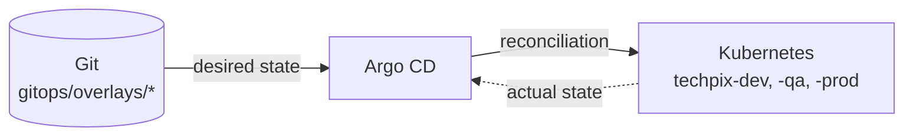

# Lab 17 — Argo CD: reconciliação

**Slide suportado:** 22 — GitOps + Argo CD
**Tag:** `aula07-step-11-gitops-argocd`

## Problema

O lab 16 deu à Tech Pix uma fonte de verdade (Git). Mas nada compara o Git com o cluster. O drift de PROD (Git: 4 réplicas, cluster: 1) fica lá até alguém rodar `kubectl apply` por acaso.

## O que observar

```text
Desired State (Git)  !=  Actual State (cluster)
            |
          Drift
            |
   Argo CD reconciliation
            |
     Actual == Desired
```

```bash
kubectl -n argocd get applications        # Synced / OutOfSync, Healthy / Degraded
scripts/argocd-drift-demo.sh              # provoca drift em dev e mostra o Argo CD desfazendo
```

## Mudança

Três `Application` do Argo CD, em [argocd/applications/](../../argocd/applications/):

| Application | path | syncPolicy | Por quê |
|---|---|---|---|
| `techpix-dev` | `gitops/overlays/dev` | automated, prune, selfHeal | dev pode ser corrigido sem perguntar |
| `techpix-qa` | `gitops/overlays/qa` | automated, prune, selfHeal | idem |
| `techpix-prod` | `gitops/overlays/prod` | **manual** | o drift é detectado; alguém aprova o sync |



`selfHeal: true` significa: se alguém mudar o cluster, o Argo CD volta ao Git. `prune: true`: se um recurso sumir do Git, some do cluster.

## Como executar

**Pré-requisito real:** o Argo CD roda **dentro** do cluster e clona o repositório de lá. Este repositório precisa estar em um Git remoto que o cluster alcance (GitHub, GitLab, Gitea). Um diretório local não serve.

```bash
git remote add origin https://github.com/SEU-USUARIO/tech-pix.git
git push -u origin main --tags

TECHPIX_GIT_URL=https://github.com/SEU-USUARIO/tech-pix.git scripts/argocd-up.sh
kubectl -n argocd port-forward svc/argocd-server 8443:443     # UI em https://localhost:8443, usuario admin
```

Instalar antes da aula: a primeira instalação baixa várias imagens e leva alguns minutos.

### Demonstração de drift

```bash
scripts/argocd-drift-demo.sh
```

```text
== desired state (Git, via Argo CD): fraud-service replicas=2
== alguem altera o cluster na mao:
deployment.apps/fraud-service scaled
== actual state agora:
NAME            READY   UP-TO-DATE   AVAILABLE
fraud-service   2/5     5            2
== Argo CD: Desired != Actual -> drift -> reconciliation. Aguardando...
   t=  2s  replicas=5  sync=OutOfSync
   t=  4s  replicas=5  sync=OutOfSync
   t=  6s  replicas=2  sync=Synced
== reconciliado: o cluster voltou ao que o Git diz (2 replicas).
```

Na interface, a Application fica amarela (OutOfSync) por alguns segundos e volta a verde.

Depois, faça a mudança do jeito certo:

```bash
sed -i 's/replicas: 2/replicas: 3/' gitops/overlays/dev/patch-replicas.yaml   # so o fraud-service
git commit -am "dev: fraud-service com 3 replicas para o teste de carga"
git push
# em ate 3 minutos (ou imediatamente com webhook), techpix-dev tem 3 replicas
```

### PROD

```bash
kubectl -n techpix-prod scale deploy fraud-service --replicas=1
kubectl -n argocd get application techpix-prod     # OutOfSync. Nao corrige sozinho.
argocd app sync techpix-prod                       # ou o botao Sync na UI
```

## Como testar

Os testes Java não dependem do Argo CD. Esta etapa é validada por:

```bash
kubectl kustomize gitops/overlays/dev | kubectl apply --dry-run=server -f -
kubectl -n argocd get applications
```

Se não for possível rodar o Argo CD na aula (sem repositório remoto, sem tempo), a demonstração de drift do lab 16 (`kubectl scale` sem reconciliação) mais a saída acima cumpre o objetivo pedagógico: ver a diferença entre **ter** um desired state e **reconciliar** com ele.

## Trade-offs

```text
Argo CD
+ drift visivel na interface antes de virar incidente
+ selfHeal desfaz mudancas manuais (onde escolhemos)
+ auditoria: cada sync aponta para um commit

- mais um componente critico, com seu proprio ciclo de vida e monitoramento
- latencia: polling de 3 min por padrao; webhook resolve, mas e mais configuracao
- o Argo CD nao ve estado em memoria: PUT /admin/fraud/mode nao gera drift detectavel.
  Por isso, fora de DEV, a flag so muda por ConfigMap (e restart) ou por commit.
- selfHeal em PROD e uma decisao de risco que precisa estar escrita (ADR 005)
- precisa de um Git remoto acessivel pelo cluster; laboratorio offline nao funciona
```

## Pergunta para discussão

> O Argo CD desfez o `kubectl scale` em 6 segundos. Isso é bom ou ruim durante um incidente às 3h da manhã, quando o operador precisa escalar **agora**?

(Depende de ter um caminho rápido e legítimo: um commit de uma linha com merge direto, ou desligar o selfHeal por uma janela. A resposta precisa existir **antes** do incidente.)

## Professor Notes

```text
Pergunta:
O que aconteceu entre t=4s e t=6s?

Resposta:
O Argo CD comparou o cluster com o Git, viu 5 != 2, e aplicou o Git. Sem ninguem pedir.

Erro comum:
Instalar o Argo CD e manter o pipeline fazendo kubectl apply. Dois donos do mesmo estado.

Conceito:
Reconciliation loop: observar, comparar, corrigir. Sempre. Git = desired state.

Transicao:
O runtime esta resolvido e governado. Mas o Fraud Service ainda le a tabela payments do monolito.
Quanta autonomia realmente conquistamos?
```

## Próximo problema

Runtime independente, deploy independente, configuração governada. E os dados? Fraud Service e monólito compartilham o mesmo PostgreSQL. [Lab 18](18-database-per-service.md).
