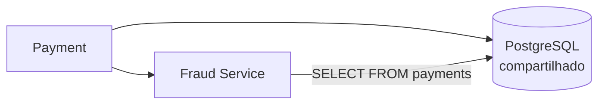
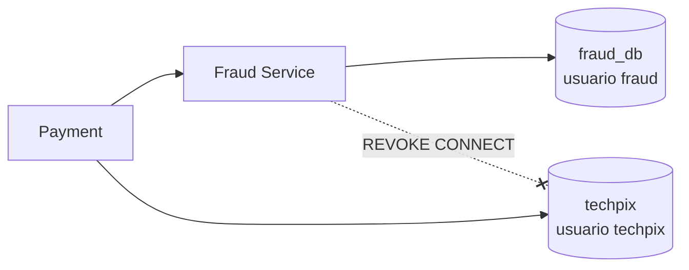

# Lab 18 — Shared Database e Database per Service

**Slides suportados:** 23 — Shared Database · 24 — Database per Service
**Tag:** `aula07-step-12-database-per-service`

## Parte 1: o problema do banco compartilhado

Fraud Service tem processo próprio, deploy próprio, escala própria, configuração governada por Git. E lê `payments` do PostgreSQL do monólito.



> Quanta autonomia realmente conquistamos?

| Problema | Onde aparece |
|---|---|
| **schema coupling** | `LegacySchemaPaymentHistory` conhece colunas de Payment |
| **deploy coupling** | uma migration de Payment exige testar (e possivelmente redeployar) Fraud |
| **ownership ambíguo** | `fraud_evaluations` e `fraud_blacklist` são de Fraud, mas nascem em migrations do monólito |
| **migrations** | quem pode alterar `payments`? Payment. Quem quebra? Fraud. |
| **acesso direto a tabelas externas** | o usuário `techpix` do Fraud Service pode ler (e escrever) qualquer tabela |
| **testes** | [legacy-schema.sql](../../fraud-service/src/test/resources/legacy-schema.sql): uma cópia do schema do monólito, mantida à mão |
| **performance** | 5 Pods de Fraud, 5 pools, no banco de Payment |

### A quebra, ao vivo

Fraud Service em modo etapa 8 (banco compartilhado):

```bash
FRAUD_DB_NAME=techpix FRAUD_DB_USER=techpix FRAUD_DB_PASSWORD=techpix \
FRAUD_FLYWAY_ENABLED=false FRAUD_HISTORY_SOURCE=LEGACY_SCHEMA scripts/start-fraud-service.sh

scripts/shared-db-breakage-demo.sh
```

```text
== 1. Fraud Service avaliando normalmente:
   HTTP 200
== 2. O time de Payment faz uma migration 'inocente' no banco DELES:
   ALTER TABLE payments RENAME COLUMN device_id TO device_fingerprint;
== 3. Fraud Service agora:
   HTTP 500   <- ninguem avisou o Fraud Service. Ninguem sabia que precisava.
== 4. Desfazendo:
   HTTP 200
```

Payment fez uma mudança no banco de Payment e derrubou Fraud. Sem rede, sem deploy, sem aviso.

## Parte 2: Database per Service



O que mudou ([ADR 006](../adr/006-fraud-data-ownership.md)):

| Antes (etapa 8) | Agora |
|---|---|
| banco `techpix`, usuário `techpix` | banco `fraud_db`, usuário `fraud` |
| Flyway desligado (schema do monólito) | Flyway do Fraud Service: [V1__fraud_store.sql](../../fraud-service/src/main/resources/db/migration/V1__fraud_store.sql) |
| `LegacySchemaPaymentHistory` lê `payments` | [LocalViewPaymentHistory](../../fraud-service/src/main/java/com/techpix/fraudservice/history/LocalViewPaymentHistory.java) lê `payment_history` |
| `legacy-schema.sql` nos testes | nenhuma tabela de Payment nos testes |

O usuário `fraud` **não consegue conectar** ao banco `techpix` ([02-fraud-db.sql](../../docker/postgres/init/02-fraud-db.sql)). A fronteira não é convenção; é `REVOKE`.

### Database ≠ instância

O laboratório usa **a mesma instância** PostgreSQL com **dois bancos lógicos** e dois usuários. Isso dá ownership e isolamento de schema. Não dá isolamento de falha nem de CPU: se a instância cair, os dois caem.

Em produção, Fraud teria sua própria instância, porque seu perfil de carga é diferente. Essa é outra decisão, com outro custo. A lição aqui não é "microserviço = banco físico". É **"dados precisam ter dono"**.

### O JOIN desapareceu

Antes, Fraud podia fazer:

```sql
SELECT count(*) FROM payments WHERE payer_account_id = ? AND created_at >= ?
```

Agora essa tabela não existe para Fraud. `FraudStoreIT.theJoinIsGone` prova: a consulta falha.

A visão local `payment_history` tem exatamente as colunas que Fraud precisa. E nasce **vazia**.

## Como executar

```bash
docker compose down -v                # o init do postgres so roda em volume novo
docker compose up -d postgres
scripts/start-fraud-service.sh        # agora em fraud_db; Flyway cria o schema
docker compose exec postgres psql -U fraud -d fraud_db -c '\dt'
docker compose exec postgres psql -U fraud -d techpix -c 'select 1'    # permission denied
```

## Como testar

```bash
./mvnw test -pl fraud-service
```

| Teste | O que prova |
|---|---|
| `FraudStoreIT.schemaIsOwnedByFraudServiceAndHasNoPaymentTables` | só tabelas de Fraud em `fraud_db` |
| `FraudStoreIT.theJoinIsGone` | `SELECT FROM payments` falha |
| `FraudStoreIT.evaluatesWithAnEmptyLocalViewAndIsBlindToHistory` | visão vazia: só `new-account` dispara; velocity nunca |
| `FraudStoreIT.localViewFeedsTheRulesOnceSomeoneFillsIt` | com a visão preenchida, mesma decisão do schema legado |
| `FraudEvaluationIT` (etapa 8, com `legacy-schema.sql`) | continua verde: o modo compartilhado ainda existe para comparação |

## Resultado esperado

```text
evaluatesWithAnEmptyLocalViewAndIsBlindToHistory:
  decision=APPROVED  triggeredRules=[new-account]  rulesEvaluated=13
```

Treze regras rodaram. As de histórico não viram nada, porque não há nada. **Um Fraud Service com banco próprio e visão vazia é um Fraud Service que aprova quase tudo.**

## Trade-offs

```text
Database per Service
+ migration de Payment nao quebra Fraud
+ testes de Fraud sem schema de Payment
+ escalar Fraud nao pressiona o banco de Payment
+ ownership explicito e imposto (REVOKE)

- o JOIN desapareceu: a visao local precisa ser alimentada por alguem
- duplicacao intencional: payment_history e uma copia; copias atrasam (consistencia eventual)
- dois bancos: backups, migrations, credenciais, monitoramento em dobro
- Fraud perde acesso a fatos que nao sao dele (quando a conta foi aberta) e passa a depender do que os eventos contam
- a regra new-account muda de semantica sem mudar de codigo
```

## Pergunta para discussão

> A visão local está vazia. Como Fraud obtém o histórico de Payment sem voltar a ler a tabela de Payment?

## Professor Notes

```text
Pergunta:
Depois da extracao (lab 08), Fraud era autonomo?

Resposta:
Em runtime e deploy, sim. Em dados, nao. Uma migration de Payment o derrubava.

Erro comum:
"Database per service" entendido como "uma instancia RDS por servico, obrigatoriamente".
O principio e ownership. Instancia e uma decisao de isolamento, separada.

Conceito:
Dados precisam ter dono. O dono escreve; os outros perguntam ou escutam.

Transicao:
Fraud precisa do historico de pagamentos e nao pode mais ler a tabela.
Payment precisa contar a Fraud o que aconteceu. Isso e um evento.
```

## Próximo problema

Payment precisa contar a Fraud os fatos relevantes (pagamento aprovado, rejeitado) sem que Fraud leia o banco de Payment. [Lab 19](19-kafka.md).
