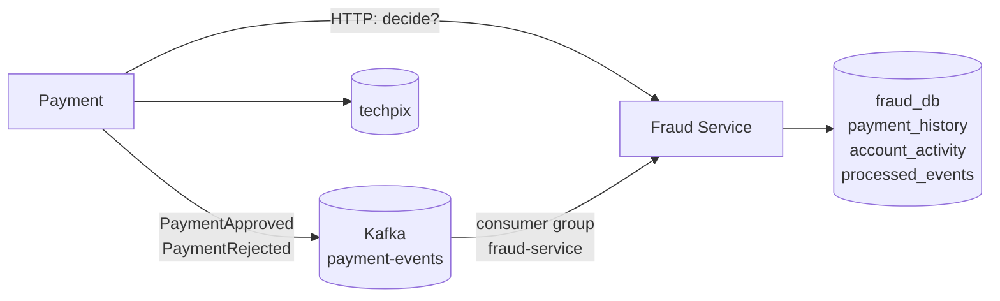

# Lab 19 — Kafka: o JOIN virou evento

**Slide suportado:** 25 — Kafka
**Tag:** `aula07-step-13-kafka`

## Problema

O JOIN desapareceu (lab 18). A visão local de Fraud está vazia. Fraud aprova quase tudo porque não vê histórico.

> Como Fraud obtém o histórico de Payment sem ler o banco de Payment?

Payment precisa **contar** o que aconteceu. Fraud precisa **escutar** e guardar o que lhe interessa.

## O que observar

```bash
docker compose exec kafka /opt/kafka/bin/kafka-console-consumer.sh \
  --bootstrap-server localhost:9092 --topic payment-events --from-beginning --property print.key=true

curl localhost:8081/admin/fraud/accounts/<payerId>/activity
curl localhost:8081/actuator/metrics/fraud.events.applied
curl localhost:8081/actuator/metrics/fraud.events.duplicates
```

## Mudança



| Conceito | Onde |
|---|---|
| **evento** | [PaymentEvent.java](../../monolith/src/main/java/com/techpix/payment/PaymentEvent.java): o contrato público de Payment. Sem `rejection_reason`, sem saldo. |
| **producer** | [KafkaPaymentEventPublisher.java](../../monolith/src/main/java/com/techpix/payment/internal/events/KafkaPaymentEventPublisher.java): publica depois do commit; chave = `payerAccountId` |
| **consumer** | [PaymentEventsConsumer.java](../../fraud-service/src/main/java/com/techpix/fraudservice/messaging/PaymentEventsConsumer.java): `@KafkaListener` |
| **consumer group** | `fraud-service`: as réplicas dividem as partições; cada evento chega a uma delas |
| **offset** | posição de leitura do grupo, commitada depois de processar. Morreu antes de commitar? O evento chega de novo. |
| **ordering** | garantida **por partição**. Chave = pagador, então os fatos de um pagador chegam em ordem. Entre pagadores, não. |
| **eventual consistency** | `PaymentEventsConsumerIT`: o teste precisa **esperar** (`await()`) o evento chegar. Antes, um `SELECT` via o dado no mesmo instante. |
| **duplicação intencional** | `payment_history` é uma cópia parcial de `payments`. Com dono. |

O contrato do consumidor ([PaymentEventMessage.java](../../fraud-service/src/main/java/com/techpix/fraudservice/messaging/PaymentEventMessage.java)) é uma classe **separada** do produtor. Não há módulo compartilhado. Campos desconhecidos são ignorados.

Onde Kafka **não** entrou: a decisão de fraude continua HTTP síncrono. Notification, Ledger, Account não publicam nada. Kafka resolve um problema específico (histórico sem JOIN), não vira o barramento de tudo.

## Idempotência: o problema antes da solução

Kafka entrega **pelo menos uma vez**. Simular uma redelivery:

```bash
scripts/replay-event.sh <paymentId>       # republica o MESMO eventId
```

O `eventId` é determinístico (`paymentId + tipo`), então a redelivery é indistinguível de uma duplicata real.

`payment_history` é atualizada por upsert (chave `payment_id`): naturalmente idempotente. `account_activity` é atualizada por **incremento**: não é. Sem proteção, um evento duplicado conta duas vezes.

Solução: [ProcessedEvents.java](../../fraud-service/src/main/java/com/techpix/fraudservice/history/ProcessedEvents.java). `INSERT ... ON CONFLICT DO NOTHING` em `processed_events`, **na mesma transação** da atualização. Já visto? Ignora. Ou tudo, ou nada.

`IdempotencyIT`:

```text
given the same event twice
when Fraud consumes
then state changes once
```

| Teste | Idempotência | `approvedCount` | `approvedAmountTotal` |
|---|---|---|---|
| `withoutIdempotencyADuplicateEventCountsTwice` | desligada | **2** | **200.00** |
| `withIdempotencyTheSameEventChangesStateOnce` | ligada | 1 | 100.00 |

## Como executar

```bash
docker compose down -v
docker compose --profile app up -d            # postgres, kafka, monolith, fraud-service (eventos ligados)
scripts/demo-payment.sh                        # um pagamento aprovado
docker compose logs fraud-service | grep "aplicado"
scripts/replay-event.sh <paymentId>            # redelivery
docker compose logs fraud-service | grep "DUPLICADO"
```

Para ver o problema:

```bash
curl -X PUT localhost:8081/admin/fraud/idempotency -H 'Content-Type: application/json' -d '{"enabled":false}'
scripts/replay-event.sh <paymentId>
curl localhost:8081/admin/fraud/accounts/<payerId>/activity      # approvedCount subiu de novo
curl -X PUT localhost:8081/admin/fraud/idempotency -H 'Content-Type: application/json' -d '{"enabled":true}'
```

## Como testar

```bash
./mvnw test
```

| Módulo | Teste | O que prova |
|---|---|---|
| monolith | `PaymentEventsIT` | pagamento aprovado e rejeitado viram fatos no tópico; replay gera o mesmo `eventId` |
| fraud-service | `PaymentEventsConsumerIT` | fato chega à visão local; velocity só aparece **depois** dos eventos; avaliações em andamento contam antes de qualquer evento |
| fraud-service | `IdempotencyIT` | o problema (desligada) e a solução (ligada) |

Todos com Kafka real (Testcontainers, `apache/kafka-native`).

## Trade-offs

```text
Kafka
+ Fraud tem historico sem depender do banco nem da disponibilidade de Payment
+ Payment nao sabe quem escuta; um novo consumidor nao muda Payment
+ o log permite reconstruir a visao local do zero

- consistencia eventual: ha um intervalo entre o commit em Payment e a linha em Fraud
- pelo menos uma vez: duplicatas sao normais, idempotencia e obrigatoria
- dual write: commit no banco + publish no Kafka nao sao atomicos (outbox pattern, lab 20)
- ordem so por chave
- mais infraestrutura: broker, topicos, contratos de evento versionados
- copia de dados com politica propria (retencao, divergencia)
```

## Pergunta para discussão

> O Kafka caiu por 5 minutos. Payment continuou aprovando pagamentos. O que aconteceu com esses fatos? O que Fraud sabe sobre esses 5 minutos?

(Perderam-se, porque publicamos depois do commit sem outbox. Fraud tem um buraco de 5 minutos na visão local. É o assunto do lab 20.)

## Professor Notes

```text
Pergunta:
Por que Payment publica PaymentApproved e nao "PaymentRow"?

Resposta:
Porque o evento e um FATO de negocio, nao a linha da tabela. A tabela e de Payment.
O fato e publico. Mudar a tabela nao muda o fato.

Erro comum:
Publicar a entidade inteira ("ja que estamos publicando"). Todo consumidor passa a depender
de todas as colunas. E o Shared Database de novo, por outro caminho.

Conceito:
Eventos carregam fatos; consumidores mantem a visao que precisam; idempotencia e obrigatoria.

Transicao:
Agora temos rede sincrona (HTTP) e assincrona (Kafka), dois bancos, duplicacao de dados.
Cada uma dessas coisas pode falhar de um jeito novo. Bem-vindos aos sistemas distribuidos.
```

## Próximo problema

Payment depende de rede para decidir (HTTP) e para contar (Kafka). Rede falha. Timeouts, retries, duplicatas, fatos perdidos, operações que atravessam dois serviços. [Lab 20](20-distributed-systems.md).
