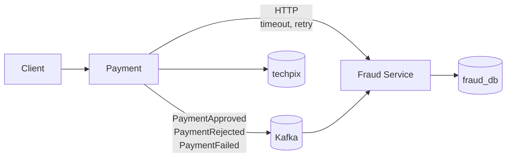

# Lab 20 — Complexidade dos sistemas distribuídos

**Slide suportado:** 26 — Complexidade dos sistemas distribuídos
**Tag:** `aula07-step-14-distributed-problems`

## Problema

A Tech Pix agora é um sistema distribuído: dois processos, dois bancos, HTTP síncrono, Kafka assíncrono, dados duplicados. Cada uma dessas coisas falha de um jeito que não existia no lab 01.

Este lab não introduz tecnologia. Introduz os problemas que as tecnologias anteriores criaram, e a resposta mínima para cada um.



## Parte 1: rede. Timeout e retry

Payment chama Fraud por HTTP. A rede pode: demorar, recusar, responder 500, ou aceitar a requisição e perder a resposta.

### O que observar

```bash
scripts/chaos.sh latency 800          # Fraud Service demora 800 ms
scripts/chaos.sh errors 0.5           # 50% respondem 500
scripts/chaos.sh off
curl localhost:8080/actuator/metrics/fraud.remote.retries
curl localhost:8080/actuator/metrics/fraud.remote.roundtrip
```

### Por que retry ingênuo piora incidentes

Fraud Service está lento porque está sobrecarregado. Mil clientes recebem timeout e tentam de novo **imediatamente**, todos juntos. Agora são dois mil pedidos em um serviço que não dava conta de mil. Ele fica mais lento. Mais timeouts. Mais retries. Isso tem nome: retry storm.

### A resposta mínima

[RetryPolicy.java](../../monolith/src/main/java/com/techpix/fraud/internal/strangler/RetryPolicy.java), 40 linhas, sem biblioteca, para que cada decisão fique visível:

```text
timeout          500 ms para conectar, 2 s para ler (RemoteFraudClient)
retry limitado   3 tentativas no total
backoff          100 ms, 200 ms (dobra a cada tentativa, teto de 1 s)
jitter           +-20%: os mil clientes nao tentam de novo no mesmo milissegundo
so o que vale    timeout e 5xx, sim; 4xx, nao (a requisicao esta errada)
```

E o que retry **não** resolve: se o Fraud Service processou a primeira chamada e a resposta se perdeu, a segunda chamada processa de novo. **Retry sem idempotência do outro lado duplica efeitos.** Fraud tolera (duas avaliações são inofensivas). Um débito não toleraria. `TimeoutRetryIT.retryWithoutIdempotencyOnTheOtherSideDuplicatesEffects` documenta isso com um teste.

`TimeoutRetryIT`:

| Teste | Cenário | Resultado |
|---|---|---|
| `transientErrorsAreRetriedAndThePaymentSucceeds` | 500, 500, 200 | 201, 3 chamadas |
| `retriesAreBoundedAndTheClientGetsAClearAnswer` | 503 sempre | 503 em < 2 s, exatamente 3 chamadas |
| `timeoutsAreRetriedButStillBounded` | demora 1 s, timeout 300 ms | 503, 3 chamadas, ~1 s (não 3 s) |
| `clientErrorsAreNotRetried...` | 400 | 503, **1** chamada |
| `retryWithoutIdempotency...DuplicatesEffects` | 1a lenta, 2a ok | 201, o serviço processou **2 vezes** |

## Parte 2: dual write

Payment commita no banco e **depois** publica no Kafka. Dois sistemas, duas escritas, sem transação entre elas.

```text
commit OK   +  publish OK     -> tudo certo
commit OK   +  Kafka fora     -> pagamento existe, fato perdido. Fraud tem um buraco.
commit falha                  -> nada publicado. Certo.
```

A resposta é o **outbox pattern**: gravar o evento em uma tabela `outbox` na mesma transação do pagamento, e um processo separado (relay) publicar a partir dela. Não implementado neste laboratório; é a dívida mais importante que fica documentada. Sem outbox, "pelo menos uma vez" não é garantido do lado do produtor.

## Parte 3: uma operação que atravessa serviços

Só agora existe uma operação que precisa de coordenação entre serviços. Antes deste ponto, falar em Saga seria falar de um problema que não existia.

```text
1. Payment   registra PENDING                   (techpix)
2. Fraud     avalia e registra EVALUATED        (fraud_db, outro processo)  <- ja aconteceu
3. Payment   liquida: saldo + ledger + APPROVED (techpix)                   <- FALHA
```

O passo 2 está commitado em outro banco. Não há `ROLLBACK` que o alcance.

### Simular

```bash
TECHPIX_LEDGER_FAIL_AMOUNT=13.37 scripts/start.sh        # o ledger falha para esse valor exato
# em outro terminal, com Fraud Service e Kafka de pe:
curl -s -X POST localhost:8080/payments -H 'Content-Type: application/json' \
  -d '{"payerAccountId":"...","payeeAccountId":"...","amount":13.37,"deviceId":"d"}'
# 503 payment failed: ledger unavailable
docker compose logs fraud-service | grep "aplicado: status=FAILED"
```

### A resposta mínima: compensação

```text
local transaction   Payment marca FAILED (nao REJECTED: nao e fraude)
       +
event               PaymentFailed
       +
compensation        Fraud: EVALUATED -> FAILED. Nao conta como rejeicao. O pagador nao e punido.
```

[ADR 008](../adr/008-saga-compensation.md). É **coreografia**: cada serviço reage a eventos, ninguém coordena.

| | Coreografia | Orquestração |
|---|---|---|
| quem coordena | ninguém; cada serviço reage a eventos | um coordenador com máquina de estados |
| acoplamento | baixo | o coordenador conhece todos |
| "em que estado está o pagamento X?" | juntar logs de N serviços | perguntar ao coordenador |
| quando usar | poucos passos, poucas compensações (o nosso caso) | muitos passos, ordem, timeouts, compensações em cadeia |

Não transformamos o laboratório em uma implementação de Saga. Um passo, uma compensação, um teste em cada lado:

- monolith: `PaymentEventsIT.ledgerFailureAfterFraudIsCompensatedWithPaymentFailed`: 503, saldo intacto, `PaymentFailed` no tópico, status `FAILED`.
- fraud-service: `PaymentEventsConsumerIT.compensationMarksTheEvaluatedPaymentAsFailedWithoutPenalizingThePayer`: `EVALUATED` vira `FAILED`, `rejectedCount` continua 0.

## Parte 4: o que mais mudou sem ninguém pedir

| No lab 01 | Agora |
|---|---|
| uma transação | quatro fases, dois bancos, um tópico |
| `FraudService.evaluate()` ou responde ou derruba o processo | responde, demora, falha, ou responde e a resposta se perde |
| `SELECT FROM payments` | visão local, eventual, alimentada por eventos |
| um log | dois processos, correlacionados por `paymentId` |
| um deploy | dois serviços, três ambientes, um Argo CD |
| "deu erro" | "deu erro em qual serviço, em qual tentativa, antes ou depois do commit?" |

## Trade-offs (o resumo de tudo)

```text
Microservice
+ independent scaling        (lab 11: Fraud 5, Payment 2)
+ isolation                  (lab 06: CPU de Fraud nao rouba de Payment)
+ independent deploy         (lab 08: Fraud Service tem seu ciclo)

- network                    (lab 07: FraudUnavailableException nao existia)
- timeout                    (lab 20)
- retry                      (lab 20: limitado, backoff, jitter; e ainda assim duplica sem idempotencia)
- deployment complexity      (labs 09-17: Kubernetes, probes, GitOps, Argo CD)
- observability              (lab 08: dois logs; lab 14: comparador)
- consistency                (labs 18-20: eventual, idempotencia, compensacao)
```

## Pergunta para discussão

> Olhe o `PaymentService` do lab 01 e o de agora. Qual é mais fácil de entender? Qual atende 1.000 TPS com Fraud escalando sozinho? Os dois podem ser a resposta certa. Para qual Tech Pix?

## Professor Notes

```text
Pergunta:
Por que a Saga so aparece no ultimo lab?

Resposta:
Porque so agora existe uma operacao que atravessa dois bancos. Antes disso, Saga seria
solucao sem problema.

Erro comum:
Comecar o projeto "preparado para Saga", com orquestrador e compensacoes, antes de haver
um segundo servico. Ou o oposto: distribuir e nunca perguntar o que acontece quando o passo 3 falha.

Conceito:
Cada tecnologia desta aula respondeu a um problema medido. Cada uma trouxe problemas novos.
A arquitetura final existe porque os problemas existiram, nessa ordem.

Fechamento:
Distribuir e consequencia, nao objetivo.
```

## Fim

A pergunta que o aluno deve conseguir responder:

> Por que essa arquitetura existe?

Não "porque microserviços são modernos". Porque:

```text
Monolith
    |  performance evidence          (labs 02-03)
Modular Monolith                     (labs 04-05)
    |  operational difference        (lab 06)
Fraud Extraction                     (labs 07-08)
    |  independent runtime           (labs 09-12)
Kubernetes
    |  safe migration                (labs 13-15)
Parallel Run / Canary
    |  environment complexity        (labs 16-17)
GitOps / Argo CD
    |  data ownership                (lab 18)
Database per Service
    |  need for shared facts         (lab 19)
Kafka
    |
Distributed System Problems          (lab 20)
```
